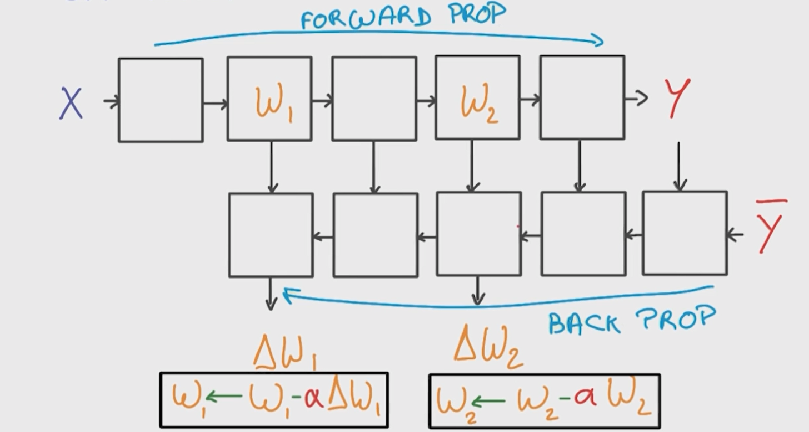

# First classifier 

Our problem is taking  a matrix representing a letter in input and finding the corrsponding letter in output.
First, we take our input X, and using weights W and regularization b, we get scores Y=WX+b = [2.0 , 1.0, 0.1] 

Note that we need to work a bit on our input, in order to correctly train our weights, we will make our inputs **0 mean** and **equal variance**. Then we sill initialize our weights randomly with a relatively small variance.

### softmax
We know that an image can either be an a, a b, or a c but not 2 at the same time. So we want to maximize the probability of correct class and minimize the probability of other classes, for this we will use a softmax on Y. $$S(y_i)= \frac{e^{y_i}}{\sum_j e^{y_j}}$$


### One-Hot encoding
let's use a classifier to find if a letter is either {a,b,c} . 
To represent results, we can use **one-hot encoding**, representing letters by a vector of size 3 such that a= [1,0,0] ; b=[0,1,0] and c=[0,0,1] . In this way, if the vector that comes out of the classifiers is [0.7, 0.2, 0.1] we can easily measure how well we are doing using cross entropy.

It works very well for lots of problem, but for a large number of different outputs, our output vectors become too big. We can use embeddings to solve this.


### Cross entropy 

The cross entropy is $$D(S,L) = - \sum_i{L_i \log(S_i)}$$

 D being distance
 S our solution [0.7, 0.2, 0.1]
 L the correct label [1.0, 0.0, 0.0]
 
 
so X -> linear model ( Y=WX+b ) -> softmax (S(Y)) -> cross entropy (D(S,L)) it's called **multinomial logistic classification**

### Measuring performances
We don't want to have overfitting so we split our input set into:

 - **training set**  train with this
 - **validation set** use output of validation to tune your model
 - **testing set** use this set only to measure real performances

first assignment notebook **notMNIST**


### Stochastic gradient descent  (SGD)
Training logistic regression with gradient descent is great as you are optimizing the error. But, it has problems, the biggest one being it's hard to scale. Indeed, 
the loss function being $$L=\sum D_i$$ , so working on all data it leads to computing a derivative multipled by the learning rate $$\alpha \delta L(w_1, w_2)$$ . And since it's iterative, we have to do this calculation for each step so it's really compute intensive. Si instead of computing the loss, we are going to compute an estimate of it (a bad estimate).
Instead of computing the loss on all the data, we are going to use a tiny random sample of the data (1 to 1000 samples).


### Momentum
At each step, we are taking a small step forward to our solution. Momentum idea is to use knowledge of previous steps direction and speed in order to go to our solution faster.

We will define a running average $$ M = 0.9 M + \delta L$$ then our direction will be $$- \alpha M(w_1, w_2)$$

Next, we will also use a **learning rate decay** (ex exponential decay, or only when there is a plateau, .. )

### Overview

We have seen that quite a few parameters needs to be tuned: 

 - initial learning rate
 - learning rate decay
 - momentum
 - batch size
 - weight initialization
 
 But when things are not working, the first thing to do if often to lower the learning rate! We can also look at **ADAGRAD** which is a tuning of SGD doing momentum and learning rate decay automatically.

### Linear model complexity
In general, if we have N inputs features and K outputs, linear models will need (N+1)K parameters.


# Deep Neural networks
We want to introduce some non linearity, for this we need non-linear functions. The first of it being **ReLU** .

### Rectified Linar Unit (ReLU)
Its the simplest non linear function, it's $$y=max(0,x)$$

### first network
With this function, we can build our first network! Let's start from our previous model 
```
X -> linear model ( Y=WX+b ) -> softmax (S(Y)) 
```
Our first neural network (2-layers) will be 
```
X -> linear model ( Y=WX+b ) -> ReLU(Y_2=max(0,Y)) -> -> linear model ( Y_3=W_2*Y_2+b_2 ) -> softmax (S(Y_3))
```
The first layer is `Y=WX+b -> ReLU(Y)`
We will need to choose how many ReLU units we want and that's it!

### back propagation
to train our network, we will use back-propagation. Some functions like ReLU don't need to be trained (blank in the graph), for other we will use chain rules: *the derivative of f(g(x)) is g'(f(x)) * f'(x)*



second assignment notebook **2_fullyconnected**

Then, it's quite straightforward to have a deeper network adding more layers. Usually, we will get better performances with a deeper network than with a larger one.

### regularization

We can do **early termination**, meaning stopping the training when validation set performances start to decrease. It will prevent too much overfitting. Another thing to do is **regularization**: applying artificial constraints on your network that implicitely reduce the number of free parameters while not making it more difficult to optimize. 

#### L2 regularization
L2 regularization is $$L_2 = L + \beta \frac{1}{2} \norm{W}_2^2$$ The idea is to add a term to the loss that minimize large weights. Note that the derivative of the second term is just $$W$$ !

#### dropout
Another recent technique for regularization that works well is **dropout**. It consist of randomly deactivate some activation (boxes) for each training example (50% or less). It ensure that your network cannot rely on any specific activation because they might get squashed at any given moment. So it forces the network to be somewhat redundant.

With dropout, we want to take the consensus over these redundant models aka averaging the output of the different models. $$Y_e ~ E(Y_t)$$ with *e* standing for evaluation and *t* for training

# Convolutional Neural Network (CNN)

## statistical invariance
Sometimes some features we get are not usefull for the learning we want to do! For example, if we want to guess which letter from the alphabet an image is, the color of this letter is not usefull. In the same way, if want to know if a picture represents a cat, the position of the cat in the image (left upper corner or center or .. ) is not usefull! In this later case, we want to tell our network to apply some **translation invariance**.

The way to achieve this in a network is using **weight sharing**: when we know that two inputs can contain the same kind of information, then we share the weights and train the weights jointly ofr these inputs.

## convnets
Convnets of convolutional networks are neural networks that share their parameters across space.
For an image, it's like sliding the same network on small sets of the image (sliding a kernel over patches of the image with a stride of few pixels). Instead of a stack of matrix multiply layers, we'are going to have stacks of convolutions with the general idea of them forming a pyramid. For example taking an RGB image of 256*256 pixels, we could apply the following network:
`Input(256x256x3) -> h1(128x128x16) -> h2(64x64x64) -> h3(32x32x64) -> classifier`

We increase the depth at each steps considering it roughly represents the semantic complexity of our representation. 

Good explanation of conv2d in tensorflow in [stackoverflow](http://stackoverflow.com/questions/34619177/what-does-tf-nn-conv2d-do-in-tensorflow).

## advanced convnets
there is a lot of things we can do to improve our convnets. We will talk about **polling**, and **inception**.

### polling 
It's a better way to reduce the feature maps in the convolutional pyramid. Until now, we have used striding to shift the filters by a few pixel each time and reduce the feature map size.
What if we still do some striding with a low number (like 1) but then took all the convolutions in a neighborhood and combined them somehow! It's **polling**. We can do:

 - *max polling* Y = max(X_i) . It's parameter free, often more accurate but it's more expensive and it's need more hyper parameters (pooling size, pooling stride).
 - *average pooling* it's ike taking a blurred view.
 - *1x1 convolution* adding a 1x1 convolution allows us to have a mini neural network running over the patch instead of a linear classifier: ` Input(KxKx3) -> h_1(ixixL) -> h_2(1x1xM)` . they are relatively cheap and add some non-linearity.

### inception
The idea is at each layer of your convnet, you can make a choice: have a pooling operation or have a convolution. Then you need to decide is it a 1x1, 3x3, a 5x5. But all of them can be beneficial so why choose, let's use them all and concatenate the result! 

assignment 4

# Deep models for text analysis
Text analysis is a good problem to tackle because it's complex.

A first example of complexity is some words are more important than others: if you find "name" in a text, it doesn't give too much insight of what the text is about. However, if we find "retinopathy", we can guess it's a medical text. But retinopathy appears only in a frequency of 0.0001% in english!  That's very hard to train a network to correcty handle cases for which there is not many examples!

Another example of complexity is multiple words can mean the same or almost the same thing like "cat" or "kitty". So we sould like to share parameters of cases like this, but cat is completely different from kitty! So we have to learn that they are related.

To solve that problem, we are going to turn to **unsupervised learning** ! It's training without any label. 

## embeddings
We will take the hypothetis that similar words tend to occur in similar contexts and so we are going to identify contexts! We are going to use embeddings to map words to small vectors which are going to be close to each other when words have similar meanings and far apart when they don't. It allows us to have a representation where all the catlike things like cats, kitties, kittens are all represented by vectors that are very similar.

For comparing embeddings, because of the way they are trained, it's often better to measure the closeness using a cosine distance instead of L2:

 - cosine distance: $$cosine = \frac{V_cat . V_kitten}{ \norm{V_cat} \norm{V_kitten}}$$
 - L2: $$L2 = \norm{V_cat - V_kitten}^2_2$$
 
 That's because the length of the embedding vector is not relevant to the classification.

## word2vec
It's a surprisingly simple model that works very well. Let's take the sentence `the quick brown fox uumps over the lazy dog`. For each word in this sentence, we are going to map it to an embedding. Then we are going to use that embedding to try to predict the context of the word. In this model, the context is simply the words that are nearby. We will define a *window size* to choose how many nearby words to take. Then, train the network to try to predict the word given words in the window.
So a basic model will be:
```
CAT -> V_cat=Embedding(CAT) -> LM = WV_cat + b -> S=softmax(LM)  ->  y = cross_entropy( S, vocabulary) 

```

## sampled softmax
A problem we will have is that our vocabulary is quite big so computing the softmax function over all these can be quite long but there is a trick. Instead of treating the softmax as is the label had probability of 1 and evry other word has probability of 0, we can sample the words that are not the target ond only pick a handful of them and act as if the other words were not there. This idea of sampling the negative targets for each example if often called **sampled softmax**.

## t-SNE
If we want to check the representation of our embedding, we may be tempted to reduce the dimensionality to 2 or 3 (2D or 3D) using **PCA**. However, with **PCA** we will lose too much information so it's best to us **t-SNE**. Things that are close in the embedding space should remain close to the ends and things that are far should be far from each other.


## Analogies
With this vector representation, we can do funny things:

 - semantic analogy `puppy - dog + kat -> kitten`
 - syntactic analogy `taller - tall + short -> shorter`

# Recurrent Neural Networks
However in the current model, we use fixed windows size but text or speech sentences don't always gave the same size! We will now introduce **Recurrent Neural Networks**. The idea is instead using the same network across space, let's use it across time. A basic RNN cell looks like this:
```

          Y
          ^
        __|__
        |   |
PAST -> | W | -> FUTURE 
        |___|
          |
          X
```
With *X* as input, *Y* as output, and *W* as our network for one time step.

## back-propagation through time
Since we back-propagate through time, it means that there will be a lot of correlated updates to the same weigth at the same time. It's bad for Stochastic Gradient Descent (SGD) as this algorithm prefers to have uncorrelated updates to its parameters, for the stability of the training. This makes the math very unstable: either the gradient grow exponentially and we end up with infinities or they vanish to zero very quickly. It's the *exploding or vanishing gradient problem*.

In order to solve the exploding gradient problem, we are going to use **gradient cipping**: compute the norm of the gradient and shrink their step when the norm grow too big.

To solve the gradient vanishing problem (which can be describe as memory loss in RNNs aka the model only remenber recent events) we are going to use **LSTM**.

## Long Short-Term Memory (LSTM)
A simple model of memory should be able to do 3 things: Read, Write, and Forget. A LSTM is simply adding this simple idea of memory to our network. So we will partially add some of X to our memory  (using a continous/differentiable function), we will partially read some of our memory, and we will partially forget some of our memory at each time step. We use a continous/differentiable function so that we can train it through back-propagation. We will also add a *tanh* regularization at reading time to keep our read between [-1.0, 1.0].

For LSTM, we can use L2 or dropout as regularization but only on the input(X) or the output(Y), not on the past or the future.

## Beam search
Once the network is ready, we can use it to predict the future for example, the next character of `The quick br` . We will have a list of characters with their associated probability: [(A,0.3), .. (O,0.4), .. ] . 
We can also try to predict 2 or more characters and compute the probability of having `AA` for example P(A)*P(A|A) . It will prevent us for making a decision then finds out it wasn't a good one but still being stuck with it. 

Of course, it becomes quite greedy and it's where **beam serach** comes in. Insted of taking all the possible characters, we will just select a handfull of them.
